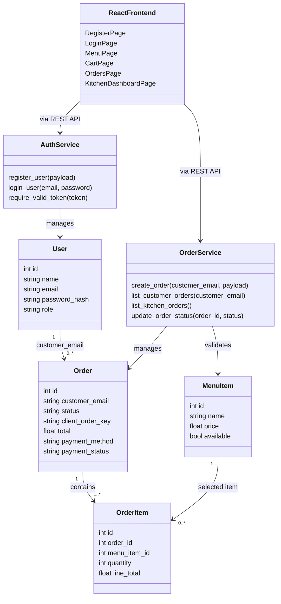
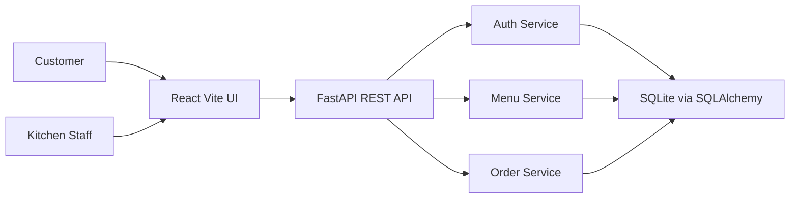
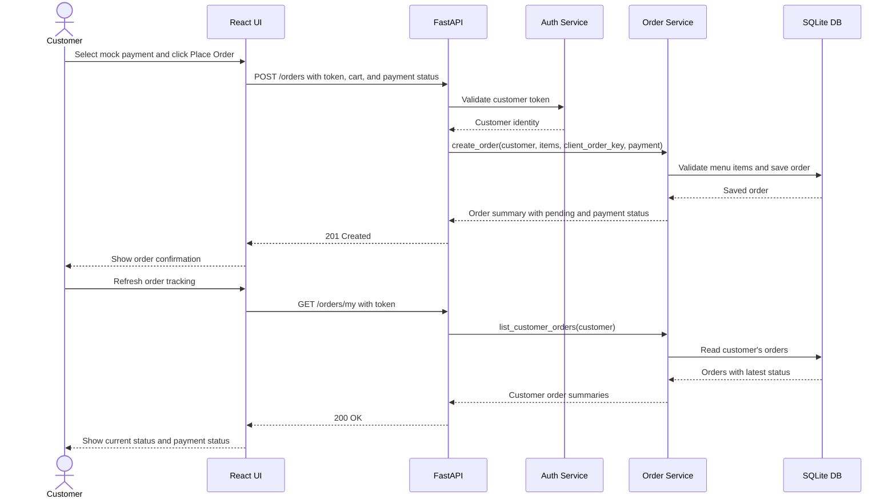
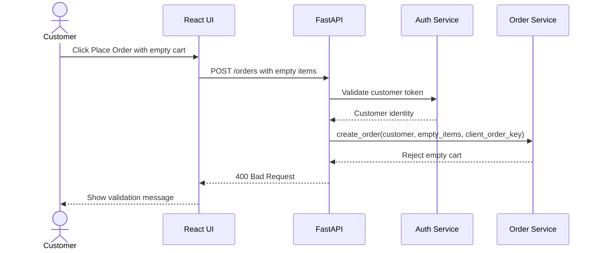
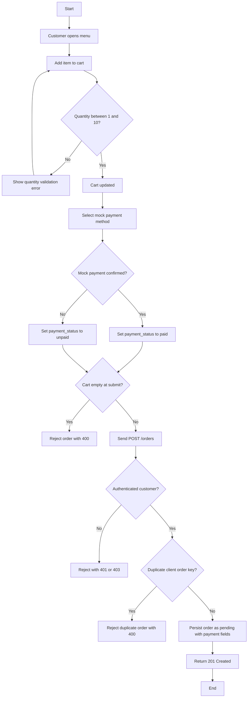
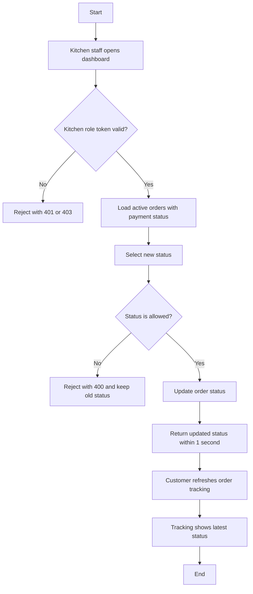
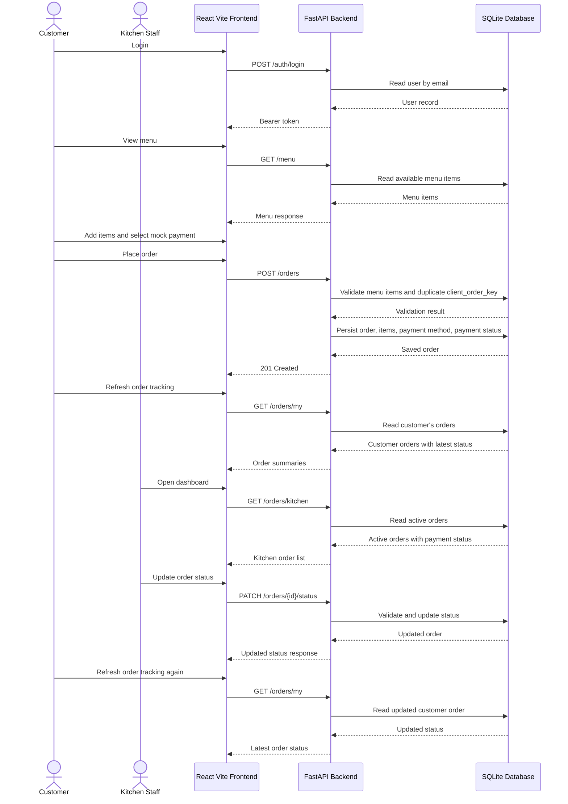
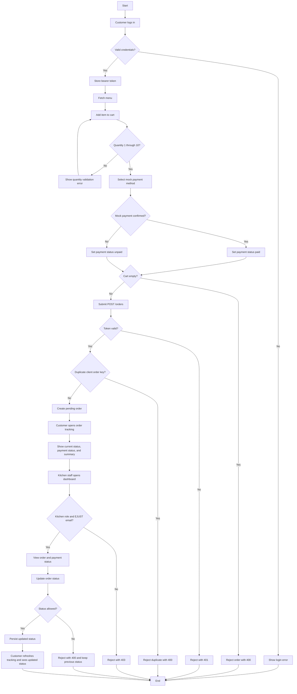

# Final Documentation Package

Customer Ordering System  
Software Engineering Term Project

This master document consolidates the important documentation from the project `docs/` folder into one PDF-ready, GitHub-readable package for academic submission, demo discussion, and grading review. The original source markdown files remain in place for file-level traceability, but reviewers can use this document as the primary navigation point.

## Documentation Index

### How To Use This Package

Open this file during discussion or demo first. It is organized around the rubric deliverables and includes requirements, traceability, design, UML diagrams, API contracts, testing evidence, validation evidence, Playwright/POM evidence, and the AI assistance appendix.

### Rubric Coverage Map

| Rubric Area | Consolidated Sections | Main Evidence |
| --- | --- | --- |
| D2 Requirements Report | Sections 1, 2, 7, 8 | Requirements, actors, personas, edge cases, traceability, QA refinement, Gherkin scenarios. |
| D3 Design Specification | Sections 3, 4, 5, 6 | Architecture, module boundaries, system sequence diagrams, activity diagrams, class diagram, API contracts. |
| D4 Validation Report | Sections 12, 13 | Validated workflow, verification vs validation distinction, evidence mapping. |
| D5 TDP Evidence | Sections 9, 10, 11 | Failing-first workflow, pytest evidence, testing pyramid, Playwright automation, POM explanation. |

### Source Document Consolidation Map

| Original Source File | Consolidated Section |
| --- | --- |
| `docs/requirements_report.md` | 1. D2 Requirements Report |
| `docs/traceability_matrix.md` | 2. D2 Traceability Matrix and Heatmap |
| `docs/design_specification.md` | 3. D3 Design Specification and Architecture |
| `docs/diagrams/system_sequence_diagram.md` | 4. D3 UML System Sequence Diagram Artifact |
| `docs/diagrams/activity_diagram.md` | 5. D3 UML Activity Diagram Artifact |
| `docs/api_contracts.md` | 6. D3 API Contracts |
| `docs/qa_refinement_log.md` | 7. D2 QA Refinement Log |
| `docs/gherkin_scenarios.md` | 8. D2 Gherkin Scenarios |
| `docs/tdp_iteration_evidence.md` | 9. D5 TDP Iteration Evidence |
| `docs/testing_pyramid_report.md` | 10. D5 Testing Pyramid Report |
| `docs/playwright_automation.md` | 11. D5 Playwright Automation and POM Evidence |
| `docs/validation_report.md` | 12. D4 Validation Report |
| `docs/verification_vs_validation.md` | 13. D4 Verification vs Validation |
| `docs/ai_prompt_appendix.md` | 14. AI Assistance Appendix |

### Quick Discussion Path

1. Start with Section 1 for requirements and actor/persona discovery.
2. Move to Section 2 for traceability and orphan-check evidence.
3. Use Sections 3 through 6 for architecture, UML, and API design discussion.
4. Use Sections 9 through 11 for TDD and testing evidence.
5. Use Sections 12 and 13 for validation and verification discussion.
6. Use Section 14 for the AI assistance appendix.

### Export Notes

This file is suitable for PDF export from GitHub, VS Code Markdown preview, Typora, Obsidian, or Pandoc. Mermaid diagrams should be rendered by a Markdown viewer with Mermaid support, or exported separately if the PDF renderer does not support Mermaid.

---

# 1. D2 Requirements Report

_Source: `docs/requirements_report.md`_

# Requirements Report

## Source Summary

This report is based on:

- `CSE323_Project_Overview.pdf`
- `CSE323_Project_Guidelines.pdf`

The selected subsystem is a small Customer Ordering System. The grading goal is not maximum features; it is complete engineering evidence across requirements discovery, traceability, design, TDD, testing, and validation.

## Actor Classification

### Primary Actors

| Actor | Rationale | Main Goals |
| --- | --- | --- |
| Customer | Initiates registration, login, menu browsing, cart actions, order placement, and order tracking. | Create account, log in, view menu, add items, submit order, track current order status. |
| Kitchen Staff | Initiates order status changes after receiving customer orders. | View pending orders, update order status accurately. |

### Supporting Actors

| Actor | Rationale | Main Responsibilities |
| --- | --- | --- |
| Authentication Service | Supports identity checks for protected actions. | Validate credentials, issue simple access token, reject invalid access. |
| Menu Data Store | Supplies item names, prices, and availability. | Provide menu list to customers and tests. |
| Order Data Store | Persists cart-derived orders, mock payment fields, and status changes. | Store orders, items, quantities, payment status, statuses, timestamps. |

### Offstage Actors

| Actor | Rationale | Interest |
| --- | --- | --- |
| Course Evaluator | Does not use the app directly as a business actor, but evaluates engineering evidence. | Traceability, TDD evidence, validation reports, runnable demo. |
| Restaurant Owner | Benefits from reduced order handling mistakes but is not part of the implemented workflow. | Clear, minimal ordering flow and kitchen visibility. |
| System Maintainer | Maintains code after submission. | Simple architecture, clear tests, no unnecessary infrastructure. |

## Personas

### Persona 1: Frustrated Customer

Name: Mina

Behavior: Repeatedly clicks "Place Order", enters unusual quantities, and expects clear feedback when the cart is empty or login fails.

Need: The system must reject invalid orders without corrupting data or creating duplicates.

### Persona 2: Busy Kitchen Staff

Name: Salma

Behavior: Opens the kitchen dashboard during a rush, updates order statuses quickly, and may act on stale information.

Need: The system must show only authorized kitchen actions and keep order status transitions predictable.

### Persona 3: Malicious Student Tester

Name: Kareem

Behavior: Calls protected APIs without a token, tries invalid quantities, and attempts unsupported status updates.

Need: The system must enforce boundaries at API level, not only in the UI.

## Core Requirements

| ID | Requirement | Source/Rationale | Priority | Acceptance Metric |
| --- | --- | --- | --- | --- |
| FR-01 | A customer can register with name, email, and password. | Required feature: Register/Login. | Must | Valid registration returns HTTP 201 and creates one user. |
| FR-02 | A customer can log in with valid credentials. | Required feature: Register/Login. | Must | Valid login returns HTTP 200 and an access token. |
| FR-03 | Invalid login attempts are rejected. | Persona edge case. | Must | Invalid login returns HTTP 401 with no token. |
| FR-04 | A customer can view menu items. | Required feature: View Menu. | Must | Menu endpoint returns at least 3 seeded items in under 2 seconds. |
| FR-05 | A customer can add menu items to a cart in the UI. | Required feature: Add To Cart. | Must | Quantity must be an integer from 1 to 10 per item. |
| FR-06 | A customer can place an order from a non-empty cart. | Required feature: Place Order. | Must | Valid order returns HTTP 201 and status `pending`. |
| FR-07 | Empty cart orders are rejected. | Persona edge case. | Must | Empty order returns HTTP 400 and creates no order. |
| FR-08 | Duplicate rapid order submissions are controlled. | Persona edge case. | Should | Same client order key cannot create more than one order. |
| FR-09 | Kitchen staff can view submitted orders. | Required feature: Kitchen Dashboard. | Must | Dashboard returns pending/preparing/ready orders in under 2 seconds. |
| FR-10 | Kitchen staff can update order status. | Required feature: Update Order Status. | Must | Valid status update is reflected by API within 1 second. |
| FR-11 | Unauthorized users cannot access kitchen actions. | Persona edge case. | Must | Missing or customer token returns HTTP 401 or 403. |
| FR-12 | Invalid order status transitions are rejected. | Edge case and race prevention. | Should | Unsupported status returns HTTP 400 and original status remains unchanged. |
| FR-13 | Expired or invalid access tokens are rejected before protected actions are executed. | Authentication edge case. | Must | Protected routes return HTTP 401 and perform no data read/write action. |
| FR-14 | Kitchen staff registration and access require an email ending with `@ejust.edu.eg`. | Domain restriction for staff workflow. | Must | Non-EJUST kitchen registration returns HTTP 400 and kitchen access requires the EJUST staff domain. |
| FR-15 | A lightweight mock payment status is captured with each order. | Demo-friendly payment simulation. | Should | Order responses and kitchen dashboard show payment method and `paid`/`unpaid` status without real payment processing. |
| FR-16 | A customer can view the latest status, payment status, and summary for their own orders. | Customer order tracking enhancement. | Should | Customer order tracking returns only the logged-in customer's orders and reflects kitchen status updates after refresh. |
| NFR-01 | API response time for normal demo data is under 2 seconds. | QA refinement metric. | Must | Verified by integration/E2E tests or documented manual timing. |
| NFR-02 | Password length must be at least 8 characters. | Measurable security boundary. | Must | Registration with fewer than 8 chars returns HTTP 422 or 400. |
| NFR-03 | The implementation remains small and maintainable. | Project instruction and rubric fit. | Must | No Docker, Redis, PostgreSQL, Redux, real payment integration, analytics, or cloud code. |

## Hidden Requirements and Edge Cases

| Edge Case ID | Case | Requirement Impact | Expected Handling |
| --- | --- | --- | --- |
| EC-01 | Duplicate order caused by double-clicking submit. | FR-08 | Use a client order key or server-side duplicate guard in service tests. |
| EC-02 | Invalid quantity such as 0, -1, 11, or text. | FR-05 | Reject outside integer range 1 to 10. |
| EC-03 | Empty cart submission. | FR-07 | Return validation error and create no order. |
| EC-04 | Unauthorized kitchen access. | FR-11 | Reject missing/customer token before reading or updating kitchen data. |
| EC-05 | Network interruption during order placement. | FR-08, validation | UI keeps cart state until order success is confirmed. |
| EC-06 | Invalid login credentials. | FR-03 | Return a generic failed-login response without issuing a token. |
| EC-07 | Order update race condition or stale status. | FR-12 | Reject unsupported transitions and verify unchanged persisted status. |
| EC-08 | Expired or invalid access token on protected action. | FR-13 | Return 401 before protected order or kitchen logic executes. |
| EC-09 | Non-EJUST email attempts kitchen staff registration. | FR-14 | Return 400 with a staff-domain validation message. |
| EC-10 | Customer marks mock payment as unpaid. | FR-15 | Store and display `unpaid` status for kitchen visibility. |
| EC-11 | Kitchen updates an order after customer placed it. | FR-16 | Customer tracking refresh shows the updated status. |

## Requirement Quality Rules

- Every feature must map to at least one requirement ID.
- Every test must cite one or more requirement IDs.
- Every API endpoint must cite one or more requirement IDs.
- No implementation feature should exist unless it supports the required small subsystem.

---

# 2. D2 Traceability Matrix and Heatmap

_Source: `docs/traceability_matrix.md`_

# Traceability Matrix and Heatmap

## Traceability Rules

- Zero orphaned requirements: every requirement must map to a feature, API, test type, and validation evidence.
- Zero orphaned features: every feature must map back to a requirement.
- Implementation, tests, and reports preserve these IDs.

## Heatmap Legend

| Mark | Meaning |
| --- | --- |
| H | High coverage or direct evidence required |
| M | Medium/supporting coverage required |
| L | Low/indirect coverage required |
| NA | Not applicable |

## Requirement to Evidence Heatmap

| Requirement | Feature | API Contract | Unit Tests | Integration Tests | E2E Tests | Docs Evidence | Current Status |
| --- | --- | --- | --- | --- | --- | --- | --- |
| FR-01 Register | Register/Login | H | H | M | M | H | Implemented |
| FR-02 Login | Register/Login | H | H | M | H | H | Implemented |
| FR-03 Invalid login | Register/Login | H | H | M | M | H | Implemented |
| FR-04 View menu | View Menu | H | M | H | H | H | Implemented |
| FR-05 Add to cart | Add To Cart | M | H | M | H | H | Implemented |
| FR-06 Place order | Place Order | H | H | H | H | H | Implemented |
| FR-07 Empty cart rejection | Place Order | H | H | H | M | H | Implemented |
| FR-08 Duplicate order guard | Place Order | H | H | H | M | H | Implemented |
| FR-09 Kitchen dashboard | Kitchen Dashboard | H | M | H | H | H | Implemented |
| FR-10 Update status | Update Order Status | H | H | H | H | H | Implemented |
| FR-11 Unauthorized kitchen access | Kitchen Dashboard, Update Status | H | H | H | M | H | Implemented |
| FR-12 Invalid status transition | Update Order Status | H | H | H | M | H | Implemented |
| FR-13 Expired or invalid token rejection | Protected API Actions | H | H | H | M | H | Implemented |
| FR-14 EJUST kitchen staff domain | Register/Login, Kitchen Access | H | H | H | L | H | Implemented |
| FR-15 Mock payment status | Place Order, Kitchen Dashboard | H | M | H | L | H | Implemented |
| FR-16 Customer order tracking | Order Tracking | H | H | H | L | H | Implemented |
| NFR-01 API response under 2 seconds | All API features | M | NA | M | M | H | Implemented |
| NFR-02 Password length >= 8 | Register | H | H | M | M | H | Implemented |
| NFR-03 Minimal maintainable system | All features | NA | NA | NA | NA | H | Implemented |

## Feature to Requirement Mapping

| Feature | Requirement IDs | Orphan Status |
| --- | --- | --- |
| Register/Login | FR-01, FR-02, FR-03, FR-14, NFR-02 | Not orphaned |
| View Menu | FR-04, NFR-01 | Not orphaned |
| Add To Cart | FR-05 | Not orphaned |
| Place Order | FR-06, FR-07, FR-08, FR-15, NFR-01 | Not orphaned |
| Order Tracking | FR-13, FR-16, NFR-01 | Not orphaned |
| Protected API Actions | FR-13 | Not orphaned |
| Kitchen Dashboard | FR-09, FR-11, FR-13, FR-14, FR-15, NFR-01 | Not orphaned |
| Update Order Status | FR-10, FR-11, FR-12, FR-13, FR-14, NFR-01 | Not orphaned |

## Detailed Requirement Traceability

| Requirement | API | Implementation | Tests | Validation Evidence |
| --- | --- | --- | --- | --- |
| FR-01 | `POST /auth/register` | `auth_service.register_user`, `routers/auth.py` | `test_auth_service.py`, `test_auth_api.py`, Playwright register flow | User can register through API and UI. |
| FR-02 | `POST /auth/login` | `auth_service.login_user`, token helper | `test_auth_service.py`, `test_auth_api.py`, Playwright login flow | User can log in and view menu. |
| FR-03 | `POST /auth/login` | invalid credential branch | `test_auth_service.py`, `test_auth_api.py` | Invalid login returns 401. |
| FR-04 | `GET /menu` | `menu_service.list_menu_items`, menu router | `test_menu_service.py`, `test_menu_orders_api.py`, Playwright menu assertions | Seeded menu appears in API and UI. |
| FR-05 | `POST /orders` | `validate_order_items`, cart UI quantity controls | `test_order_service.py`, `test_menu_orders_api.py` | Invalid quantities are rejected. |
| FR-06 | `POST /orders` | `order_service.create_order`, cart UI | `test_order_service.py`, `test_menu_orders_api.py` | Valid cart creates pending order. |
| FR-07 | `POST /orders` | empty cart validation | `test_order_service.py`, `test_menu_orders_api.py` | Empty cart returns 400. |
| FR-08 | `POST /orders` | duplicate `client_order_key` check | `test_order_service.py`, `test_menu_orders_api.py` | Duplicate order key is rejected. |
| FR-09 | `GET /orders/kitchen` | `list_kitchen_orders`, kitchen UI | `test_order_service.py`, `test_kitchen_api.py` | Kitchen dashboard shows active orders. |
| FR-10 | `PATCH /orders/{id}/status` | `update_order_status`, kitchen UI status select | `test_order_service.py`, `test_kitchen_api.py` | Kitchen can update valid status. |
| FR-11 | Kitchen endpoints | `require_kitchen` dependency | `test_kitchen_api.py` | Customer kitchen access returns 403. |
| FR-12 | `PATCH /orders/{id}/status` | allowed status validation | `test_order_service.py`, `test_kitchen_api.py` | Invalid status is rejected and order remains unchanged. |
| FR-13 | Protected endpoints | token validation helper | `test_auth_service.py`, `test_menu_orders_api.py`, `test_kitchen_api.py` | Invalid token returns 401. |
| FR-14 | `POST /auth/register`, kitchen endpoints | kitchen email-domain validation | `test_auth_service.py`, `test_auth_api.py` | Only `@ejust.edu.eg` kitchen staff are accepted. |
| FR-15 | `POST /orders`, `GET /orders/kitchen` | order payment fields, cart payment UI, kitchen display | `test_menu_orders_api.py`, `test_kitchen_api.py` | Mock payment method/status appears in customer and kitchen workflows. |
| FR-16 | `GET /orders/my`, `PATCH /orders/{id}/status` | `list_customer_orders`, order tracking UI, status refresh | `test_order_service.py`, `test_menu_orders_api.py` | Customer sees own order summary and latest kitchen-updated status. |

## Testing Pyramid Evidence

Target testing pyramid:

- 70 percent unit tests
- 20 percent integration tests
- 10 percent Playwright E2E tests

Actual current automated count:

| Layer | Count | Approx Ratio |
| --- | ---: | ---: |
| Unit | 20 | 44 percent |
| Integration | 23 | 51 percent |
| E2E | 2 | 5 percent |

The implemented suite is intentionally integration-heavy because the rubric emphasizes API contracts and traceability. Browser E2E coverage remains small to avoid duplicating backend edge-case tests.

---

# 3. D3 Design Specification and Architecture

_Source: `docs/design_specification.md`_

## 3.1 UML Class Diagram

The following class diagram summarizes the implemented backend domain structure and frontend page/API relationships. It reflects the current minimal architecture only.



# Design Specification

## Design Goal

Build one small vertical slice: customer registration/login, menu browsing, cart order submission with mock payment status, customer order tracking, kitchen dashboard, and order status update.

The design favors explicit contracts, simple modules, SQLite persistence, and testable service functions.

## Architecture



## Module Boundaries

| Layer | Responsibility | Hidden Details |
| --- | --- | --- |
| Frontend pages | User workflows and basic client-side validation. | Database, password hashing, SQLAlchemy. |
| API routers | HTTP request/response mapping and auth checks. | Business rule internals. |
| Services | Registration, login, order placement, status update rules. | HTTP framework details. |
| Models | Persistent entities. | UI and test runner details. |
| Schemas | Request/response validation. | Database session internals. |

## System Sequence Diagram: Place Order Happy Path



## System Sequence Diagram: Empty Cart Failure Path



## Activity Diagram: Order Placement



## Activity Diagram: Kitchen Status Update



## Data Model Sketch

| Entity | Fields |
| --- | --- |
| User | id, name, email, password_hash, role |
| MenuItem | id, name, price, available |
| Order | id, customer_email, status, client_order_key, total, payment_method, payment_status |
| OrderItem | id, order_id, menu_item_id, quantity, line_total |

## Design Decisions

- Use SQLite for local demo persistence.
- Use service functions for business rules so unit tests can avoid HTTP setup.
- Use API contracts as the boundary between frontend and backend.
- Use a simple bearer token for academic demo authentication.
- Keep cart state in the frontend until order submission succeeds.
- Use refresh-based customer tracking instead of realtime sockets to keep the demo small.
- Store mock payment method and paid/unpaid status only; no real payment gateway is used.

## Technology Justification

- FastAPI was selected because it supports small REST APIs with automatic request validation and OpenAPI documentation, which helps keep API contracts measurable and testable.
- SQLite was selected because it is file-based, simple to run locally, and sufficient for a demo-sized ordering workflow without deployment infrastructure.
- React + Vite was selected because it provides a lightweight frontend setup with fast local development and minimal configuration.
- pytest was selected for backend unit and integration tests because it supports clear boundary-focused tests; Playwright was selected for E2E validation because it can execute browser workflows using the Page Object Model.

## Traceability

Each diagram and endpoint maps to the requirement IDs in `traceability_matrix.md` and `api_contracts.md`.

---

# 4. D3 UML System Sequence Diagram Artifact

_Source: `docs/diagrams/system_sequence_diagram.md`_

# System Sequence Diagram

This UML-style system sequence diagram represents the implemented customer ordering workflow only.



---

# 5. D3 UML Activity Diagram Artifact

_Source: `docs/diagrams/activity_diagram.md`_

# Activity Diagram

This activity diagram covers the implemented ordering flow, including validation and failure paths.



---

# 6. D3 API Contracts

_Source: `docs/api_contracts.md`_

# API Contracts

These contracts define shared interfaces for backend, frontend, and tests. Internal implementation details such as SQLAlchemy models, password hashing helpers, and database sessions are intentionally hidden.

Base URL during local development: `http://127.0.0.1:8000`

JSON request headers:

```http
Content-Type: application/json
```

Standard structured error shape:

```json
{
  "detail": "Human-readable error message"
}
```

## Authentication

### POST `/auth/register`

Covers: FR-01, FR-14, NFR-02

Headers:

```http
Content-Type: application/json
```

Request:

```json
{
  "name": "Mina",
  "email": "mina@example.com",
  "password": "password123",
  "role": "customer"
}
```

Validation:

- `name`: non-empty string
- `email`: valid email-like string
- `password`: minimum 8 characters
- `role`: `customer` or `kitchen`
- kitchen role requires an email ending with `@ejust.edu.eg`

Success response `201`:

```json
{
  "id": 1,
  "name": "Mina",
  "email": "mina@example.com",
  "role": "customer"
}
```

Failure responses:

- `400` duplicate email
- `400` kitchen email outside `@ejust.edu.eg`
- `422` invalid payload

Example `400` response:

```json
{
  "detail": "Email already registered"
}
```

Example kitchen domain `400` response:

```json
{
  "detail": "Kitchen staff email must end with @ejust.edu.eg"
}
```

### POST `/auth/login`

Covers: FR-02, FR-03

Headers:

```http
Content-Type: application/json
```

Request:

```json
{
  "email": "mina@example.com",
  "password": "password123"
}
```

Success response `200`:

```json
{
  "access_token": "token-value",
  "token_type": "bearer",
  "role": "customer"
}
```

Failure responses:

- `401` invalid credentials
- `422` invalid payload

Example `401` response:

```json
{
  "detail": "Invalid credentials"
}
```

## Menu

### GET `/menu`

Covers: FR-04, NFR-01

Success response `200`:

```json
[
  {
    "id": 1,
    "name": "Chicken Sandwich",
    "price": 80.0,
    "available": true
  }
]
```

Metric: response time under 2 seconds for seeded demo data.

## Orders

### POST `/orders`

Covers: FR-05, FR-06, FR-07, FR-08, FR-13, FR-15, FR-16

Headers:

```http
Content-Type: application/json
Authorization: Bearer token-value
```

Request:

```json
{
  "client_order_key": "unique-client-key",
  "payment_method": "card",
  "payment_status": "paid",
  "items": [
    {
      "menu_item_id": 1,
      "quantity": 2
    }
  ]
}
```

Validation:

- Authenticated customer required.
- `items` must contain at least 1 item.
- `quantity` must be an integer from 1 to 10.
- Reused `client_order_key` must not create duplicate orders.
- `payment_method` is optional and must be `cash`, `card`, or `wallet`.
- `payment_status` is optional and must be `paid` or `unpaid`.

Success response `201`:

```json
{
  "id": 1,
  "status": "pending",
  "items": [
    {
      "menu_item_id": 1,
      "quantity": 2,
      "line_total": 160.0
    }
  ],
  "total": 160.0,
  "payment_method": "card",
  "payment_status": "paid"
}
```

Failure responses:

- `400` empty cart, invalid quantity, duplicate order key conflict
- `401` missing/invalid token
- `403` role not allowed
- `422` invalid payload

Example `400` response:

```json
{
  "detail": "Order must contain at least one item"
}
```

Example `401` response:

```json
{
  "detail": "Unauthorized access"
}
```

Example `403` response:

```json
{
  "detail": "Kitchen role required"
}
```

### GET `/orders/my`

Covers: FR-13, FR-16, NFR-01

Headers:

```http
Authorization: Bearer token-value
```

Authorization: customer role required.

Success response `200`:

```json
[
  {
    "id": 1,
    "status": "preparing",
    "total": 160.0,
    "payment_method": "card",
    "payment_status": "paid",
    "items": [
      {
        "name": "Chicken Sandwich",
        "quantity": 2,
        "line_total": 160.0
      }
    ]
  }
]
```

Failure responses:

- `401` missing/invalid token
- `403` authenticated non-customer user

Example `401` response:

```json
{
  "detail": "Unauthorized access"
}
```

### GET `/orders/kitchen`

Covers: FR-09, FR-11, FR-13, FR-14, FR-15, NFR-01

Headers:

```http
Authorization: Bearer token-value
```

Authorization: kitchen role required.

Success response `200`:

```json
[
  {
    "id": 1,
    "customer_email": "mina@example.com",
    "status": "pending",
    "total": 160.0,
    "payment_method": "card",
    "payment_status": "paid",
    "items": [
      {
        "name": "Chicken Sandwich",
        "quantity": 2
      }
    ]
  }
]
```

Failure responses:

- `401` missing/invalid token
- `403` authenticated non-kitchen user

Example `401` response:

```json
{
  "detail": "Unauthorized access"
}
```

Example `403` response:

```json
{
  "detail": "Kitchen role required"
}
```

### PATCH `/orders/{order_id}/status`

Covers: FR-10, FR-11, FR-12, FR-13

Headers:

```http
Content-Type: application/json
Authorization: Bearer token-value
```

Request:

```json
{
  "status": "preparing"
}
```

Allowed statuses:

- `pending`
- `preparing`
- `ready`
- `completed`

Success response `200`:

```json
{
  "id": 1,
  "status": "preparing"
}
```

Failure responses:

- `400` invalid status
- `401` missing/invalid token
- `403` authenticated non-kitchen user
- `404` order not found

Example `400` response:

```json
{
  "detail": "Invalid order status"
}
```

Example `401` response:

```json
{
  "detail": "Unauthorized access"
}
```

Example `403` response:

```json
{
  "detail": "Kitchen role required"
}
```

Metric: successful update visible from API within 1 second.

---

# 7. D2 QA Refinement Log

_Source: `docs/qa_refinement_log.md`_

# QA Refinement Log

This log converts vague requirements into measurable criteria, as required by the rubric.

| Original Wording | QA Issue | Refined Metric | Requirement IDs |
| --- | --- | --- | --- |
| The app should be fast. | "Fast" is not testable. | Normal API responses for demo data must complete in under 2 seconds. | NFR-01 |
| Login should be secure. | "Secure" is too broad for this project. | Password must be at least 8 characters; invalid login returns 401 and no token. | FR-03, NFR-02 |
| Orders should update quickly. | "Quickly" is not measurable. | A successful status update must be reflected by the API within 1 second. | FR-10 |
| The cart should prevent bad input. | "Bad input" is unclear. | Quantity must be an integer from 1 to 10 inclusive. | FR-05 |
| The system should avoid duplicate orders. | Duplicate conditions are undefined. | Reusing the same client order key must not create more than one order. | FR-08 |
| Kitchen access should be protected. | "Protected" is vague. | Missing/customer token for kitchen routes must return 401 or 403 before modifying data. | FR-11 |
| Tokens should be valid. | "Valid" needs an observable result. | Expired or malformed access tokens must return 401 before protected route logic reads or writes order data. | FR-13 |
| Staff users should be restricted. | "Staff" needs a measurable domain rule. | Kitchen staff registration and access require email ending with `@ejust.edu.eg`. | FR-14 |
| Payment should be demo-only. | "Payment" could imply real integration. | Mock payment stores only method and `paid`/`unpaid` status; no real gateway or transaction is used. | FR-15 |
| Customers should see order progress. | "Progress" needs an observable refresh behavior. | Customer order tracking must show the latest status returned by `GET /orders/my` after kitchen updates. | FR-16 |
| The app should be maintainable. | Maintainability must be bounded. | No Docker, Redis, PostgreSQL, Redux, real payment integration, analytics, or cloud deployment code. | NFR-03 |

## Senior QA Audit Decisions

- Keep the scope to one vertical slice: customer order submission through kitchen status update.
- Prefer explicit validation errors over silent UI-only prevention.
- Ensure edge cases are tested at service/API level so the frontend cannot bypass constraints.
- Preserve traceability IDs in test names, service docstrings, and reports.
- Add screenshots only as validation evidence, not as a substitute for executable tests.

---

# 8. D2 Gherkin Scenarios

_Source: `docs/gherkin_scenarios.md`_

# Gherkin Scenarios

These scenarios describe the implemented Customer Ordering System only. They align with the FastAPI endpoints, React pages, pytest coverage, and Playwright browser tests currently present in the project.

## Authentication

```gherkin
Feature: User registration
  Covers: FR-01, FR-14, NFR-02

  Scenario: Register a new customer successfully
    Given no user exists with email "mina@example.com"
    When the user registers with name "Mina", email "mina@example.com", password "password123", and role "customer"
    Then the API should return status 201
    And the response should include id, name, email, and role
    And the response should not include the password

  Scenario: Register a kitchen staff account successfully
    Given no user exists with email "salma.kitchen@ejust.edu.eg"
    When the user registers with name "Salma", email "salma.kitchen@ejust.edu.eg", password "kitchen123", and role "kitchen"
    Then the API should return status 201
    And the response role should be "kitchen"

  Scenario: Reject kitchen staff registration outside the EJUST domain
    Given no user exists with email "salma.kitchen@gmail.com"
    When the user registers with name "Salma", email "salma.kitchen@gmail.com", password "kitchen123", and role "kitchen"
    Then the API should return status 400
    And the response detail should mention "@ejust.edu.eg"

  Scenario: Reject duplicate email registration
    Given a user already exists with email "mina@example.com"
    When another registration is submitted with email "mina@example.com"
    Then the API should return status 400
    And the response detail should be "Email already registered"

  Scenario Outline: Reject weak registration passwords
    Given no user exists with email "weak-password@example.com"
    When the user registers with password "<password>"
    Then the registration should be rejected
    And no account should be created

    Examples:
      | password |
      | short    |
      | 1234567  |
```

```gherkin
Feature: User login
  Covers: FR-02, FR-03

  Background:
    Given a registered customer exists with email "mina@example.com" and password "password123"

  Scenario: Login succeeds with valid credentials
    When the customer logs in with email "mina@example.com" and password "password123"
    Then the API should return status 200
    And the response should include an access token
    And the token type should be "bearer"
    And the response role should be "customer"

  Scenario: Login rejects an incorrect password
    When the customer logs in with email "mina@example.com" and password "wrong-password"
    Then the API should return status 401
    And the response detail should be "Invalid credentials"
    And no access token should be returned
```

## Menu And Cart

```gherkin
Feature: Menu retrieval and cart building
  Covers: FR-04, FR-05, NFR-01

  Background:
    Given the SQLite database contains the seeded menu items

  Scenario: Retrieve menu items successfully
    When the user requests the menu
    Then the API should return status 200
    And the response should include at least three menu items
    And each item should include id, name, price, and availability

  Scenario Outline: Reject invalid cart quantities at order validation
    Given a customer is logged in
    And the cart contains menu item 1 with quantity <quantity>
    When the customer places the order
    Then the API should return status 400
    And the response detail should mention "quantity"

    Examples:
      | quantity |
      | 0        |
      | -1       |
      | 11       |
```

## Order Placement

```gherkin
Feature: Customer order placement
  Covers: FR-06, FR-07, FR-08, FR-13, FR-15

  Background:
    Given a customer is registered and logged in
    And the menu contains item 1

  Scenario: Place an order from a non-empty cart
    Given the cart contains menu item 1 with quantity 2
    And the customer selects mock payment method "card"
    And the mock payment is confirmed as "paid"
    And the client order key is new
    When the customer places the order
    Then the API should return status 201
    And the order status should be "pending"
    And the payment status should be "paid"
    And the response should include the ordered item and total

  Scenario: Reject an empty cart
    Given the cart contains no items
    When the customer places the order
    Then the API should return status 400
    And the response detail should be "Order must contain at least one item"
    And no order should be created

  Scenario: Reject duplicate client order key
    Given an order already exists with client order key "client-order-key-duplicate"
    And the cart contains menu item 1 with quantity 1
    When the customer places another order with client order key "client-order-key-duplicate"
    Then the API should return status 400
    And the response detail should mention "duplicate"
    And no duplicate order should be created
```

```gherkin
Feature: Protected order actions
  Covers: FR-13

  Scenario: Reject order placement with an invalid token
    Given the request uses access token "expired-or-invalid-token"
    And the request contains menu item 1 with quantity 1
    When the user places an order
    Then the API should return status 401
    And the response detail should be "Unauthorized access"
    And no order should be created
```

```gherkin
Feature: Customer order tracking
  Covers: FR-13, FR-16, NFR-01

  Background:
    Given a customer is registered and logged in
    And the customer has placed an order with status "pending"

  Scenario: Customer views their own order status and summary
    When the customer opens order tracking
    Then the API should return status 200
    And the response should include the order status
    And the response should include payment status
    And the response should include item summary and total

  Scenario: Customer sees latest status after kitchen update
    Given kitchen staff updates the order status to "preparing"
    When the customer refreshes order tracking
    Then the displayed order status should be "Preparing"
```

## Kitchen Dashboard

```gherkin
Feature: Kitchen dashboard
  Covers: FR-09, FR-11, FR-13, FR-14, FR-15, NFR-01

  Background:
    Given at least one order exists with status "pending"

  Scenario: Kitchen staff views active orders
    Given a kitchen staff user with email ending "@ejust.edu.eg" is logged in
    When the kitchen staff requests the kitchen dashboard
    Then the API should return status 200
    And the response should include active orders
    And each order should include id, customer email, status, total, payment method, payment status, and items

  Scenario: Reject customer access to kitchen dashboard
    Given a customer is logged in
    When the customer requests the kitchen dashboard
    Then the API should return status 403
    And the response detail should be "Kitchen role required"

  Scenario: Reject kitchen dashboard access with an invalid token
    Given the request uses access token "expired-or-invalid-token"
    When the user requests the kitchen dashboard
    Then the API should return status 401
    And the response detail should be "Unauthorized access"
```

## Order Status Updates

```gherkin
Feature: Kitchen order status update
  Covers: FR-10, FR-11, FR-12, FR-13, FR-14

  Background:
    Given an order exists with status "pending"

  Scenario: Kitchen staff updates an order status successfully
    Given a kitchen staff user with email ending "@ejust.edu.eg" is logged in
    When the kitchen staff updates the order status to "preparing"
    Then the API should return status 200
    And the response should include the order id
    And the order status should be "preparing"

  Scenario: Reject invalid order status
    Given a kitchen staff user with email ending "@ejust.edu.eg" is logged in
    When the kitchen staff updates the order status to "archived"
    Then the API should return status 400
    And the response detail should be "Invalid order status"
    And the stored order status should remain "pending"

  Scenario: Reject customer status update
    Given a customer is logged in
    When the customer updates the order status to "preparing"
    Then the API should return status 403
    And the response detail should be "Kitchen role required"
    And the stored order status should remain unchanged

  Scenario: Reject status update with an invalid token
    Given the request uses access token "expired-or-invalid-token"
    When the user updates the order status to "preparing"
    Then the API should return status 401
    And the response detail should be "Unauthorized access"
    And the stored order status should remain unchanged
```

## Browser-Level Scenarios Covered By Playwright

```gherkin
Feature: Frontend smoke workflows

  Scenario: Homepage loads
    Given the Vite frontend is running
    When the browser opens "http://127.0.0.1:5173"
    Then the page should display the login workflow

  Scenario: Register, login, and view seeded menu
    Given the FastAPI backend is running
    And the Vite frontend is running
    When a new user registers through the browser
    And the same user logs in through the browser
    Then the menu page should display "Chicken Sandwich"
    And the menu page should display "Pasta Bowl"
    And the menu page should display "Fresh Juice"
```

---

# 9. D5 TDP Iteration Evidence

_Source: `docs/tdp_iteration_evidence.md`_

# Test-Driven Prompting Iteration Evidence

## Purpose

This document records the TDP workflow used in Phase 3. The project was intentionally implemented from tests and contracts rather than feature expansion.

## Failing-First Workflow

Step 1 created pytest tests before backend implementation existed. The initial tests intentionally failed because these targets were missing:

- `app.main`
- `app.services.auth_service`
- `app.services.menu_service`
- `app.services.order_service`

This produced failing-first evidence for:

- Registration and login.
- Menu retrieval.
- Quantity boundaries.
- Empty cart rejection.
- Duplicate order prevention.
- Kitchen dashboard access.
- Status update validation.
- Invalid token rejection.

## Implementation Driven By Tests

Step 2 implemented only the backend needed to satisfy those tests:

- FastAPI application setup.
- SQLite and SQLAlchemy setup.
- Minimal models for users, menu items, orders, and order items.
- Pydantic request/response schemas.
- Simple bearer-token authentication.
- Service-layer business rules.
- API routers matching the documented contracts.

No unrelated features were added.

## Edge-Case Padlocks

The test suite locks down these boundary and failure cases:

| Edge Case | Evidence |
| --- | --- |
| Quantity `0` | Unit and integration tests reject it. |
| Quantity `-1` | Unit and integration tests reject it. |
| Quantity `11` | Unit and integration tests reject it. |
| Empty order items | Unit and integration tests return a validation error. |
| Duplicate `client_order_key` | Unit and integration tests reject duplicate order submission. |
| Invalid token | Unit and integration tests return unauthorized access. |
| Customer accessing kitchen endpoints | Integration tests return 403. |
| Invalid status `archived` | Unit and integration tests return 400 and preserve the old status. |
| Customer tracking after kitchen update | Unit and integration tests verify the customer sees the latest status. |

## Iterative Debugging Evidence

During implementation, the first full test run showed that service-level tests passed while integration tests initially needed the HTTP client dependency used by FastAPI `TestClient`. After installing the declared dependency, remaining failures showed stale database state between tests. A small clean database fixture was added to `tests/conftest.py`, preserving duplicate checks inside a single test while making the suite repeatable.

## Duplicate Registration Regression

Manual QA discovered that duplicate email registration incorrectly succeeded. The root cause was in `auth_service.register_user`, which returned the existing user instead of rejecting the duplicate.

Regression tests were added first:

- Unit test: duplicate registration raises `ValueError("Email already registered")`.
- Integration test: duplicate `POST /auth/register` returns HTTP 400 with `{"detail": "Email already registered"}`.

The service was then changed minimally so duplicate email registration fails correctly. The frontend already displayed backend validation messages through the existing API error handling.

## Customer Tracking Enhancement

A final enhancement added failing tests first for customer order tracking. The tests initially failed because `list_customer_orders` and `GET /orders/my` did not exist. The backend then added only the read path needed for customers to refresh and see their own latest order status, payment status, and order summary.

## Current Regression Status

The backend pytest suite currently includes 43 tests across unit and integration layers. Playwright adds browser-level smoke coverage for homepage loading and register-login-menu display.

The TDP evidence demonstrates:

- Failing tests before implementation.
- Minimal implementation to satisfy requirements.
- Iterative debugging based on test output.
- Regression test added before fixing a discovered bug.
- Edge cases preserved as executable tests.

---

# 10. D5 Testing Pyramid Report

_Source: `docs/testing_pyramid_report.md`_

# Testing Pyramid Report

## Purpose

The project uses a small testing pyramid to provide rubric evidence without overbuilding the system. The intended structure is:

- 70 percent unit tests for business rules and edge-case boundaries.
- 20 percent integration tests for API contracts and persistence behavior.
- 10 percent E2E tests for browser-level validation of the main demo flow.

## Actual Current Distribution

Current automated tests:

| Layer | Location | Count | Evidence |
| --- | --- | ---: | --- |
| Unit | `tests/unit/` | 20 | Service-level tests for auth, staff domain validation, menu retrieval, quantity validation, order creation, duplicate order keys, status updates, customer order tracking, and token rejection. |
| Integration | `tests/integration/` | 23 | FastAPI `TestClient` tests for `/auth/register`, `/auth/login`, `/menu`, `/orders`, `/orders/my`, `/orders/kitchen`, and `/orders/{id}/status`. |
| E2E | `frontend/tests/e2e/` | 2 | Playwright browser tests for homepage loading and register-login-menu workflow. |

Total automated scenarios: 45.

Actual ratio by collected tests:

- Unit: 20 of 45, about 44 percent.
- Integration: 23 of 45, about 51 percent.
- E2E: 2 of 45, about 5 percent.

The suite is intentionally integration-heavy because the rubric emphasizes API contracts, traceability, and verification of observable system behavior. The E2E layer remains small, which preserves the pyramid principle that browser tests should validate critical workflows rather than duplicate every backend edge case.

## Unit Test Evidence

Unit tests focus on business rules and edge-case padlocks:

- `tests/unit/test_auth_service.py`
  - FR-01 registration success and duplicate email rejection.
  - FR-02 login success.
  - FR-03 invalid login rejection.
  - FR-13 invalid token rejection.
  - FR-14 kitchen staff `@ejust.edu.eg` domain restriction.
  - NFR-02 password length boundary.
- `tests/unit/test_menu_service.py`
  - FR-04 seeded menu retrieval.
- `tests/unit/test_order_service.py`
  - FR-05 quantity boundaries: 0, -1, and 11.
  - FR-06 valid order placement.
  - FR-07 empty cart rejection.
  - FR-08 duplicate `client_order_key` rejection.
  - FR-09 kitchen dashboard order listing.
  - FR-10 status update success.
  - FR-12 invalid status rejection.
  - FR-16 customer order tracking and status refresh evidence.

## Integration Test Evidence

Integration tests verify the documented API contracts:

- `tests/integration/test_auth_api.py`
  - Registration returns 201.
  - Duplicate registration returns 400 with `Email already registered`.
  - Login returns bearer token.
  - Invalid login returns 401.
  - Kitchen registration outside `@ejust.edu.eg` returns 400.
- `tests/integration/test_menu_orders_api.py`
  - Menu returns at least three items.
  - Invalid quantities return 400.
  - Valid order returns 201 and status `pending`.
  - Empty cart returns 400.
  - Duplicate order key returns 400.
  - Invalid token returns 401.
  - Mock payment method/status is returned with orders.
  - Customer order tracking returns current order status and summary.
- `tests/integration/test_kitchen_api.py`
  - Kitchen dashboard returns submitted orders.
  - Kitchen status update returns 200.
  - Customer access returns 403.
  - Invalid status `archived` returns 400 and preserves the old status.
  - Invalid kitchen token returns 401.
  - Kitchen dashboard includes mock payment method/status.

## Playwright E2E Evidence

Playwright tests are stored in `frontend/tests/e2e/`:

- `login.spec.js`: verifies a user can register, log in, and see the seeded menu items in the browser.
- `menu.spec.js`: verifies the homepage loads and displays the login workflow.

These tests connect the React UI to the running FastAPI backend and validate that the main browser workflow is demo-ready.

## Screenshots Evidence

The `screenshots/` folder is reserved for manual or Playwright-generated demo screenshots. Suggested screenshots:

- `screenshots/login-page.png`
- `screenshots/menu-page.png`
- `screenshots/cart-page.png`
- `screenshots/order-tracking-page.png`
- `screenshots/kitchen-dashboard.png`
- `screenshots/playwright-run.png`

Screenshots are supporting validation evidence; they do not replace automated tests.

## Commands

Backend tests:

```bash
cd "/Volumes/My Macbook/Study/Semester 8/Software Engineering/Projects/FinalProject"
/Users/mahmoudhasssan/anaconda3/bin/pytest
```

Frontend build:

```bash
cd "/Volumes/My Macbook/Study/Semester 8/Software Engineering/Projects/FinalProject/frontend"
npm run build
```

Playwright E2E tests:

```bash
cd "/Volumes/My Macbook/Study/Semester 8/Software Engineering/Projects/FinalProject/frontend"
npx playwright test tests/e2e
```

---

# 11. D5 Playwright Automation and POM Evidence

_Source: `docs/playwright_automation.md`_

# Playwright Automation

## Purpose

Playwright provides browser-level validation for the React frontend. The tests confirm that the implemented UI can be opened in a real browser context and can communicate with the FastAPI backend for the main demo workflow.

## Setup

Playwright is listed in `frontend/package.json` as a development dependency:

```json
"@playwright/test": "^1.60.0"
```

The current E2E tests are located in:

- `frontend/tests/e2e/login.spec.js`
- `frontend/tests/e2e/menu.spec.js`

The tests expect:

- Backend running at `http://127.0.0.1:8000`
- Frontend running at `http://127.0.0.1:5173`

## E2E Workflow Coverage

| Playwright Test | Workflow | Related Requirements |
| --- | --- | --- |
| `menu.spec.js` | Opens the homepage and verifies that the login workflow is visible. | FR-02 |
| `login.spec.js` | Registers a new user, logs in through the UI, and verifies seeded menu items are visible. | FR-01, FR-02, FR-04 |

The Playwright suite intentionally stays small. Backend unit and integration tests cover edge cases such as invalid quantity, empty cart, duplicate order key, unauthorized kitchen access, invalid status, and invalid token rejection.

## Relationship To Gherkin

The Playwright tests implement browser-level slices of the Gherkin scenarios:

- `Feature: Frontend smoke workflows`
- `Scenario: Homepage loads`
- `Scenario: Register, login, and view seeded menu`

Gherkin scenarios remain the readable specification. Playwright scripts are the executable browser automation evidence.

## Regression Testing Value

Playwright protects the project against regressions that backend-only tests cannot see, including:

- The frontend route/page renders correctly.
- Form labels and buttons remain discoverable by accessible role or label.
- Browser registration and login flow still works after frontend changes.
- The menu page displays data returned by the backend.

## Run Command

Start the backend:

```bash
cd "/Volumes/My Macbook/Study/Semester 8/Software Engineering/Projects/FinalProject"
PYTHONPATH=backend /Users/mahmoudhasssan/anaconda3/bin/python -m uvicorn app.main:app --host 127.0.0.1 --port 8000
```

Start the frontend:

```bash
cd "/Volumes/My Macbook/Study/Semester 8/Software Engineering/Projects/FinalProject/frontend"
npm run dev
```

Run Playwright:

```bash
cd "/Volumes/My Macbook/Study/Semester 8/Software Engineering/Projects/FinalProject/frontend"
npx playwright test tests/e2e
```

---

# 12. D4 Validation Report

_Source: `docs/validation_report.md`_

# Validation Report

## Validation Question

Does the Customer Ordering System solve the right problem for a small demo-friendly ordering workflow?

Yes. The implemented system supports the required customer-to-kitchen workflow without adding unrelated restaurant-platform features.

## Validated Workflow

The implemented vertical slice validates that:

- A customer can register and log in.
- A customer can view the seeded menu.
- A customer can add menu items to a cart.
- A customer can place a non-empty order.
- Kitchen staff can log in.
- Kitchen staff can view submitted active orders.
- Kitchen staff can update order status.
- Kitchen staff accounts are restricted to `@ejust.edu.eg` emails.
- Mock payment method and paid/unpaid status are visible to staff.
- Customer order tracking shows current status, payment status, and order summary after refresh.

## Validation Evidence

| Evidence | Result | Related Requirements |
| --- | --- | --- |
| Backend pytest suite | 43 tests pass. | FR-01 through FR-16, NFR-02 |
| Frontend production build | `npm run build` succeeds. | NFR-03 |
| Playwright browser tests | 2 tests pass. | FR-01, FR-02, FR-04 |
| API contract tests | Auth, menu, order, and kitchen endpoints return expected status codes and payloads. | FR-01 through FR-13 |
| Edge-case tests | Duplicate email, invalid login, invalid quantity, empty cart, duplicate order key, invalid token, unauthorized kitchen access, invalid staff email domain, invalid status, mock payment visibility, and customer status refresh are covered. | FR-03, FR-05, FR-07, FR-08, FR-11, FR-12, FR-13, FR-14, FR-15, FR-16 |

## Testing Pyramid Summary

| Layer | Count | Evidence |
| --- | ---: | --- |
| Unit | 20 | Service-level business rule and boundary tests. |
| Integration | 23 | FastAPI `TestClient` API contract tests. |
| E2E | 2 | Playwright browser smoke workflows. |

Detailed testing evidence is documented in `docs/testing_pyramid_report.md`.

## Verification vs Validation Statement

Verification proves the software works according to the documented requirements and API contracts. Validation proves that the implemented behavior solves the intended small Customer Ordering System problem.

This project is validated because the real workflow closes the order loop from customer login and order placement to kitchen viewing and status update. The implementation avoids real payment gateways, notifications, analytics, cloud deployment, and advanced administration because those are outside the selected subsystem.

## Residual Manual Evidence

The `screenshots/` folder is available for final demo screenshots. Screenshots are optional supporting evidence; the primary validation evidence is the passing automated test suite and runnable demo workflow.

---

# 13. D4 Verification vs Validation

_Source: `docs/verification_vs_validation.md`_

# Verification vs Validation

## Verification

Verification asks: did we build the software correctly according to its specification?

For this project, verification evidence comes from executable tests and contract checks:

- Pytest unit tests verify service-level rules for registration, login, token rejection, quantity limits, empty cart rejection, duplicate order keys, kitchen dashboard listing, and invalid status rejection.
- Pytest integration tests verify the FastAPI contracts for `/auth/register`, `/auth/login`, `/menu`, `/orders`, `/orders/my`, `/orders/kitchen`, and `/orders/{order_id}/status`.
- Playwright tests verify that the React frontend loads in a browser and that a user can register, log in, and see seeded menu items.
- Frontend build verification confirms that the React/Vite project compiles successfully.

Examples of verified behavior:

- Valid registration returns HTTP 201.
- Duplicate registration returns HTTP 400 with `Email already registered`.
- Valid login returns a bearer token.
- Empty cart order placement returns HTTP 400.
- Invalid token access returns HTTP 401.
- Customer access to kitchen routes returns HTTP 403.
- Non-EJUST kitchen staff registration returns HTTP 400.
- Mock payment method/status is returned in order and kitchen responses.
- Customer order tracking returns the latest order status after kitchen updates.
- Kitchen status update returns HTTP 200 for a valid status.
- Invalid status `archived` returns HTTP 400 and keeps the original status.

## Validation

Validation asks: did we build the right system for the intended customer ordering problem?

The validated problem is a small, demo-friendly Customer Ordering System, not a large restaurant platform. The implemented system supports the intended end-to-end workflow:

- A customer can register and log in.
- A customer can view the seeded menu.
- A customer can add menu items to a cart and place an order.
- A customer can select a mock payment method and paid/unpaid status for demo purposes.
- The order is created with status `pending`.
- A customer can refresh order tracking to see the latest status, payment status, and order summary.
- Kitchen staff can log in and view active orders.
- Kitchen staff can see mock payment details.
- Kitchen staff can update order status to a supported value.

This solves the selected subsystem because it closes the core customer-to-kitchen loop without adding unrelated features such as real payment gateways, notifications, analytics, cloud deployment, Redis, Docker, or advanced administration.

## Evidence Mapping

| Evidence | Verification Value | Validation Value |
| --- | --- | --- |
| Pytest unit tests | Prove individual business rules and edge-case boundaries. | Show that the minimal domain rules match the customer ordering workflow. |
| Pytest integration tests | Prove API status codes and response bodies match the contracts. | Show that frontend and backend can rely on stable interfaces. |
| Playwright tests | Prove browser workflows render and interact with the backend. | Show that a user can perform the main demo path through the UI. |
| Real ordering workflow | Confirms order creation and status update operate together. | Demonstrates the system solves the intended ordering-to-kitchen handoff. |
| Customer tracking workflow | Confirms customers can read their own latest order status. | Demonstrates the customer can follow an order after kitchen action. |
| Kitchen workflow | Confirms role-protected dashboard and status update behavior. | Demonstrates kitchen staff can act on submitted orders. |

## Final Distinction

Verified means the implemented code behaves correctly against the documented requirements and tests.

Validated means the implemented behavior is the right behavior for a small academic Customer Ordering System focused on ordering and kitchen status management.

---

# 14. AI Assistance Appendix

_Source: `docs/ai_prompt_appendix.md`_

# AI Assistance Appendix

## Purpose

This appendix documents how Codex/AI assistance was used during the Customer Ordering System project. AI support was used as an engineering assistant for requirements analysis, test design, implementation scaffolding, debugging, refactoring, and documentation. Human project constraints controlled the scope: the system remained minimal, rubric-focused, and limited to the implemented customer ordering workflow.

No secrets, private credentials, API keys, or sensitive personal data were included in prompts.

## How AI Tools Were Used

AI assistance was used to:

- Interpret the project overview and grading rubric.
- Convert rubric expectations into requirements, traceability, Gherkin scenarios, API contracts, and validation evidence.
- Create failing-first pytest tests before backend implementation.
- Implement the minimal FastAPI, SQLite, SQLAlchemy backend needed to satisfy the tests.
- Build a small React/Vite frontend connected to the documented backend APIs.
- Debug test failures and a duplicate-registration defect.
- Refactor Playwright E2E tests into Page Object Model structure.
- Finalize documentation for verification, validation, testing pyramid evidence, Playwright automation, and TDP iteration evidence.

AI assistance did not add unsupported features such as real payment gateways, notifications, analytics, Docker, Redis, PostgreSQL, cloud deployment, or advanced authentication.

## Prompt Categories Used

| Prompt Category | Purpose | Project Artifact Impact |
| --- | --- | --- |
| Requirements prompts | Extract actors, requirements, edge cases, and traceability from the rubric. | `requirements_report.md`, `traceability_matrix.md` |
| Design prompts | Define Gherkin scenarios, API contracts, UML diagrams, and technology justification. | `gherkin_scenarios.md`, `api_contracts.md`, `design_specification.md` |
| Testing prompts | Create failing-first unit and integration tests with requirement IDs. | `tests/unit/`, `tests/integration/`, `pytest.ini` |
| Implementation prompts | Implement only the backend/frontend behavior required by tests and API contracts. | `backend/`, `frontend/src/` |
| Debugging prompts | Diagnose failing tests and manual QA defects. | Duplicate registration regression tests and fix |
| Refactoring prompts | Convert Playwright tests to Page Object Model without changing behavior. | `frontend/tests/pages/`, `frontend/tests/e2e/` |
| Documentation prompts | Finalize validation, testing pyramid, Playwright, TDP, README, and audit docs. | `docs/`, `README.md` |

## Representative Requirement Prompts

Examples of requirement-focused prompts used:

- Analyze the project PDFs and create actor classification, traceability heatmap, persona discovery, and edge cases.
- Keep the project minimal and focused on the required Customer Ordering System features only.
- Add a requirement for expired or invalid access token rejection and preserve existing requirement IDs.
- Verify that all requirements map to features, API contracts, tests, and validation evidence.

These prompts supported requirements engineering and traceability rather than feature expansion.

## Representative Testing Prompts

Examples of testing-focused prompts used:

- Create a failing pytest suite before backend implementation.
- Cover FR-01 through FR-13 with unit and integration tests.
- Include edge-case padlocks for invalid quantities, empty cart, duplicate order key, invalid token, unauthorized kitchen access, and invalid status.
- Run pytest and report which tests fail before implementation.
- Preserve requirement IDs in test names or docstrings.

These prompts produced TDD evidence and helped keep implementation tied to measurable behavior.

## Representative Debugging Prompts

Examples of debugging-focused prompts used:

- Fix the duplicate registration bug with minimal changes only.
- Add or update tests so duplicate email registration fails correctly.
- Return a structured backend error message such as `Email already registered`.
- Verify existing tests still pass and the frontend displays backend validation messages.

The duplicate-registration bug was handled with a regression-first workflow: tests were added first, then the service behavior was corrected.

## Representative Refactoring Prompts

Examples of refactoring-focused prompts used:

- Refactor existing Playwright tests to use Page Object Model.
- Keep current tested behavior exactly the same.
- Create reusable page object classes under `frontend/tests/pages/`.
- Do not change application implementation code.

This produced reusable Playwright page objects for navigation, registration, login, and menu assertions.

## Representative Documentation Prompts

Examples of documentation-focused prompts used:

- Improve Gherkin scenarios with happy paths, failure paths, and edge cases.
- Create testing pyramid evidence with unit, integration, and E2E counts.
- Document verification versus validation using pytest, Playwright, ordering workflow, and kitchen workflow evidence.
- Create Playwright automation and TDP iteration evidence documents.
- Run a final submission audit for generated files, caches, README accuracy, and command verification.

These prompts helped align the final submission with the rubric.

## Human Oversight And Constraints

The project scope and implementation constraints were explicitly controlled:

- The selected subsystem remained a small Customer Ordering System.
- Only required features were implemented.
- Tests and documentation were checked against current implementation.
- Generated artifacts and cache files were removed or ignored before submission.
- Implementation changes were avoided during final documentation and audit phases.

## AI Use Disclosure Summary

Codex/AI assistance was used throughout the project as a guided development and documentation assistant. The final project artifacts remain aligned with the stated academic requirements: requirements discovery, traceability, software design, TDD evidence, testing, validation, and engineering process quality.

---

