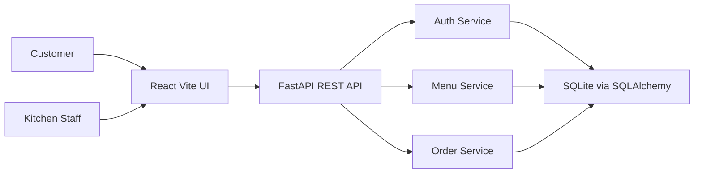
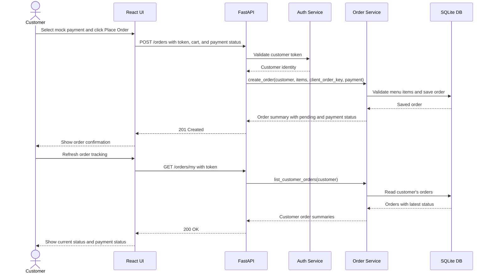
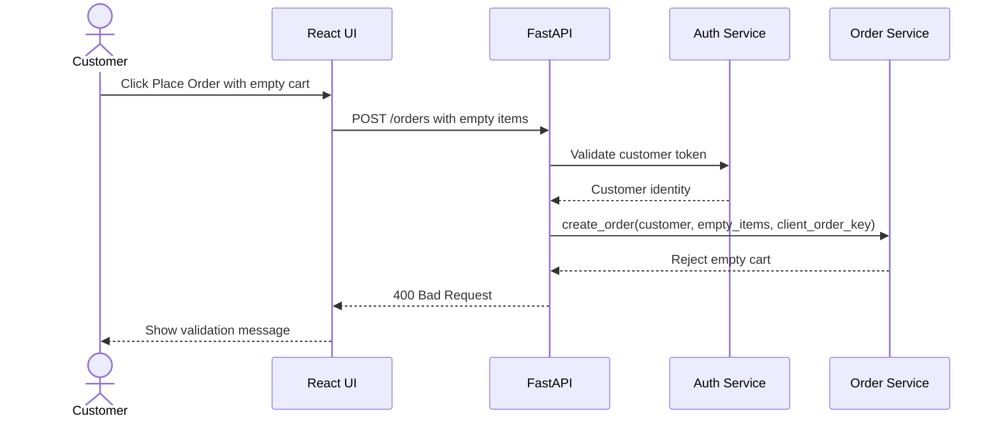
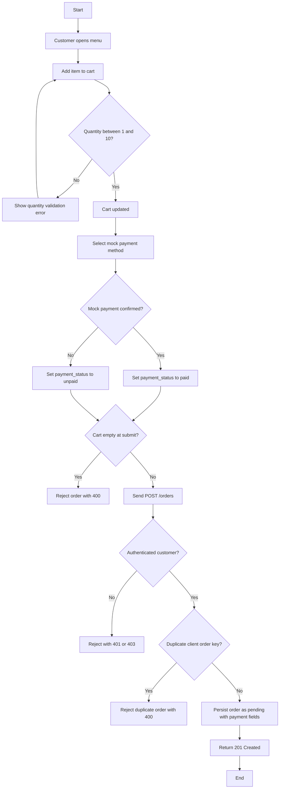
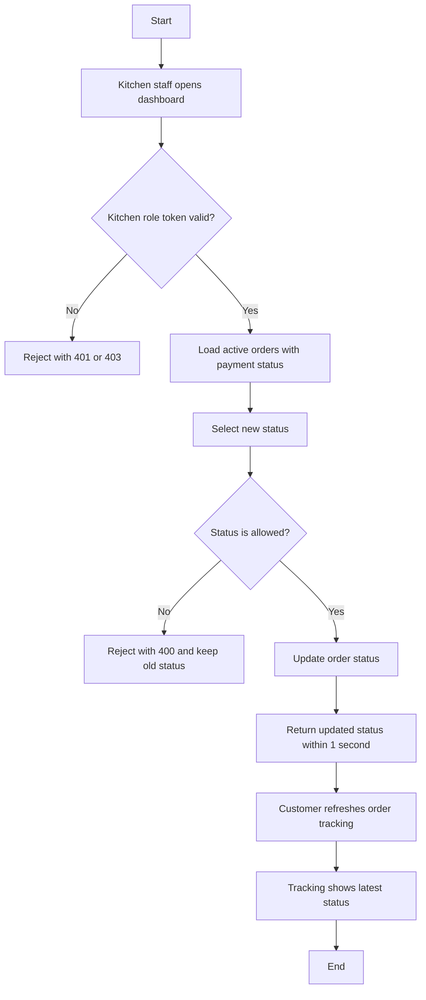
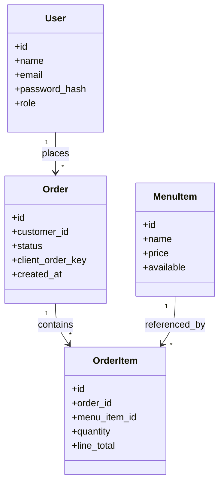

# Design Specification

## Design Goal

Build one small vertical slice: customer registration/login, menu browsing, cart order submission with mock payment status, customer order tracking, kitchen dashboard, and order status update.

The design favors explicit contracts, simple modules, SQLite persistence, and testable service functions.

## Architecture

## Module Boundaries

| Layer | Responsibility | Hidden Details |
| --- | --- | --- |
| Frontend pages | User workflows and basic client-side validation. | Database, password hashing, SQLAlchemy. |
| API routers | HTTP request/response mapping and auth checks. | Business rule internals. |
| Services | Registration, login, order placement, status update rules. | HTTP framework details. |
| Models | Persistent entities. | UI and test runner details. |
| Schemas | Request/response validation. | Database session internals. |

## System Sequence Diagram: Place Order Happy Path

## System Sequence Diagram: Empty Cart Failure Path

## Activity Diagram: Order Placement

## Activity Diagram: Kitchen Status Update

## Data Model Sketch

| Entity | Fields |
| --- | --- |
| User | id, name, email, password_hash, role |
| MenuItem | id, name, price, available |
| Order | id, customer_email, status, client_order_key, total, payment_method, payment_status |
| OrderItem | id, order_id, menu_item_id, quantity, line_total |
## Class Diagram

## Design Decisions

- Use SQLite for local demo persistence.
- Use service functions for business rules so unit tests can avoid HTTP setup.
- Use API contracts as the boundary between frontend and backend.
- Use a simple bearer token for academic demo authentication.
- Keep cart state in the frontend until order submission succeeds.
- Use refresh-based customer tracking instead of realtime sockets to keep the demo small.
- Store mock payment method and paid/unpaid status only; no real payment gateway is used.

## Technology Justification

- FastAPI was selected because it supports small REST APIs with automatic request validation and OpenAPI documentation, which helps keep API contracts measurable and testable.
- SQLite was selected because it is file-based, simple to run locally, and sufficient for a demo-sized ordering workflow without deployment infrastructure.
- React + Vite was selected because it provides a lightweight frontend setup with fast local development and minimal configuration.
- pytest was selected for backend unit and integration tests because it supports clear boundary-focused tests; Playwright was selected for E2E validation because it can execute browser workflows using the Page Object Model.

## Traceability

Each diagram and endpoint maps to the requirement IDs in `traceability_matrix.md` and `api_contracts.md`.
