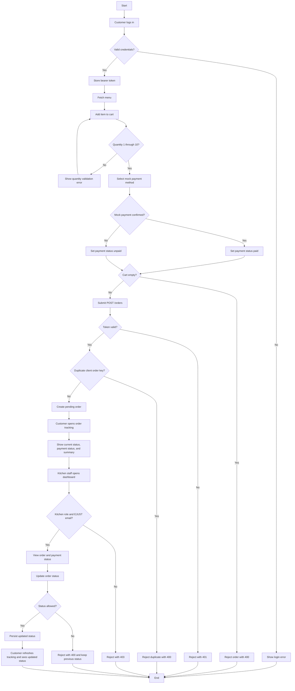

# Activity Diagram

This activity diagram covers the implemented ordering flow, including validation and failure paths.

```mermaid
flowchart TD
    A["Start"] --> B["Customer logs in"]
    B --> C{"Valid credentials?"}
    C -- No --> D["Show login error"]
    D --> Z["End"]
    C -- Yes --> E["Store bearer token"]
    E --> F["Fetch menu"]
    F --> G["Add item to cart"]
    G --> H{"Quantity 1 through 10?"}
    H -- No --> I["Show quantity validation error"]
    I --> G
    H -- Yes --> J["Select mock payment method"]
    J --> K{"Mock payment confirmed?"}
    K -- Yes --> L["Set payment status paid"]
    K -- No --> M["Set payment status unpaid"]
    L --> N{"Cart empty?"}
    M --> N
    N -- Yes --> O["Reject order with 400"]
    O --> Z
    N -- No --> P["Submit POST /orders"]
    P --> Q{"Token valid?"}
    Q -- No --> R["Reject with 401"]
    R --> Z
    Q -- Yes --> S{"Duplicate client order key?"}
    S -- Yes --> T["Reject duplicate with 400"]
    T --> Z
    S -- No --> U["Create pending order"]
    U --> AF["Customer opens order tracking"]
    AF --> AG["Show current status, payment status, and summary"]
    AG --> V["Kitchen staff opens dashboard"]
    V --> W{"Kitchen role and EJUST email?"}
    W -- No --> X["Reject with 403"]
    X --> Z
    W -- Yes --> Y["View order and payment status"]
    Y --> AA["Update order status"]
    AA --> AB{"Status allowed?"}
    AB -- No --> AC["Reject with 400 and keep previous status"]
    AC --> Z
    AB -- Yes --> AD["Persist updated status"]
    AD --> AE["Customer refreshes tracking and sees updated status"]
    AE --> Z
```
