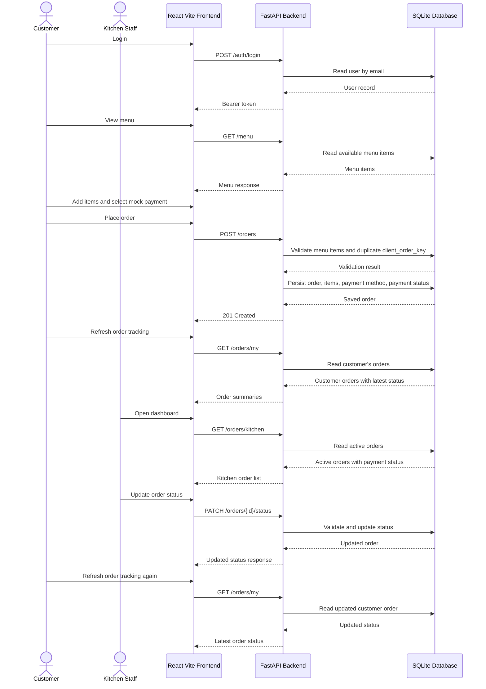

# System Sequence Diagram

This UML-style system sequence diagram represents the implemented customer ordering workflow only.

```mermaid
sequenceDiagram
    actor Customer
    actor Kitchen as Kitchen Staff
    participant UI as React Vite Frontend
    participant API as FastAPI Backend
    participant DB as SQLite Database

    Customer->>UI: Login
    UI->>API: POST /auth/login
    API->>DB: Read user by email
    DB-->>API: User record
    API-->>UI: Bearer token

    Customer->>UI: View menu
    UI->>API: GET /menu
    API->>DB: Read available menu items
    DB-->>API: Menu items
    API-->>UI: Menu response

    Customer->>UI: Add items and select mock payment
    Customer->>UI: Place order
    UI->>API: POST /orders
    API->>DB: Validate menu items and duplicate client_order_key
    DB-->>API: Validation result
    API->>DB: Persist order, items, payment method, payment status
    DB-->>API: Saved order
    API-->>UI: 201 Created

    Customer->>UI: Refresh order tracking
    UI->>API: GET /orders/my
    API->>DB: Read customer's orders
    DB-->>API: Customer orders with latest status
    API-->>UI: Order summaries

    Kitchen->>UI: Open dashboard
    UI->>API: GET /orders/kitchen
    API->>DB: Read active orders
    DB-->>API: Active orders with payment status
    API-->>UI: Kitchen order list

    Kitchen->>UI: Update order status
    UI->>API: PATCH /orders/{id}/status
    API->>DB: Validate and update status
    DB-->>API: Updated order
    API-->>UI: Updated status response

    Customer->>UI: Refresh order tracking again
    UI->>API: GET /orders/my
    API->>DB: Read updated customer order
    DB-->>API: Updated status
    API-->>UI: Latest order status
```
